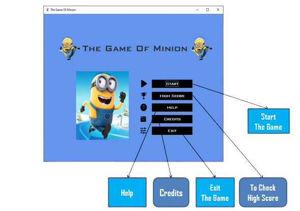

# The_Game_of_Minion
This is a Java Swing mini-game where players control a cute minion character as it traverses a side-scrolling landscape. The objective is to avoid obstacles along the way and aim for a high score.

## Project Title:
- Category(e.g: Management System/Game): Game (The Game Of Minion) 

## Game Window

## Requirements:
* Windows/Ubuntu version: Windows 10
* Compiler(with version): Eclipse Java 2019-09
* JDK/JRE: JRE [JavaSE- 12]

## Use Case
- Main/Beginning Window: Main.java
- Files: User.txt, User1.txt
- GUI: Swing

Developer: [Fariha Nur Hasin](mailto:fariha.hasin4424@gmail.com)
